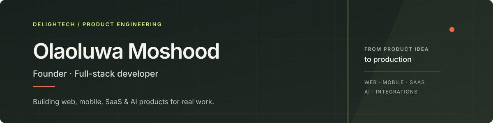
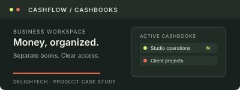

  
   <strong>DELIGHTECH</strong> &nbsp; INDEPENDENT SOFTWARE STUDIO

  

  
  &nbsp;
  

I’m **Olaoluwa Moshood**, founder and product engineer at [DelighTech](https://www.delightech.net/). I work with businesses and product teams to turn complex needs into useful software—from early product decisions through full-stack delivery.

<table>
  <tr>
    <td width="25%" valign="top">01 / WEB <strong>Applications</strong> Responsive products and APIs.</td>
    <td width="25%" valign="top">02 / SAAS <strong>Business software</strong> Tools built around real workflows.</td>
    <td width="25%" valign="top">03 / MOBILE <strong>Connected products</strong> Mobile-first web and app builds.</td>
    <td width="25%" valign="top">04 / SYSTEMS <strong>AI &amp; integrations</strong> Practical automation and APIs.</td>
  </tr>
</table>

## Technology

<table>
  <tr>
    <td width="50%" valign="top">
      01 / FRONTEND  
       
      React · Next.js · TypeScript · JavaScript · HTML · CSS · Vite
    </td>
    <td width="50%" valign="top">
      02 / BACKEND &amp; DATA  
       
      Node.js · Express · PostgreSQL · Prisma · PGlite · Supabase
    </td>
  </tr>
  <tr>
    <td width="50%" valign="top">
      03 / PLATFORM &amp; MOBILE  
       
      Git · GitHub Actions · Vercel · Railway · Capacitor · PWA
    </td>
    <td width="50%" valign="top">
      04 / INTEGRATIONS  
      <strong>AI provider APIs</strong> &nbsp;·&nbsp; Gmail &amp; Google Calendar 
      WhatsApp Business Cloud &nbsp;·&nbsp; Telegram Bot API 
      Brevo &nbsp;·&nbsp; Web Push &nbsp;·&nbsp; Paystack
    </td>
  </tr>
</table>

## Selected work

  
  

  
  

  
<strong>Project notes</strong>

   
  <ul>
    <li><strong><a href="https://github.com/myolaoluwa/Elara">Elara</a></strong> — Executive operations across meetings, tasks, follow-ups, email, and AI-assisted workflows. <a href="https://www.delightech.net/work/elara">Case study</a></li>
    <li><strong><a href="https://github.com/myolaoluwa/Nomi">Nomi</a></strong> — A personal dashboard for finances, activities, tasks, habits, and goals. <a href="https://www.delightech.net/work/nomi">Case study</a></li>
    <li><strong><a href="https://github.com/myolaoluwa/Oracle">Oracle</a></strong> — An on-chain intelligence workspace; the public walkthrough uses sample data. <a href="https://www.delightech.net/work/oracle">Case study</a></li>
    <li><strong><a href="https://www.delightech.net/work/cashflow">Cashflow</a></strong> — Business cashbooks with access controls and an Android implementation. <a href="https://www.delightech.net/work/cashflow">Case study</a></li>
  </ul>

  
<strong>GitHub activity &amp; language statistics</strong>

   
  

    
    
  

  <strong>Have a product problem worth solving?</strong> 
  Tell me what you’re building. We can explore the right next step together.  
  
  &nbsp;
  

DelighTech · Lagos, Nigeria · Working with teams worldwide

